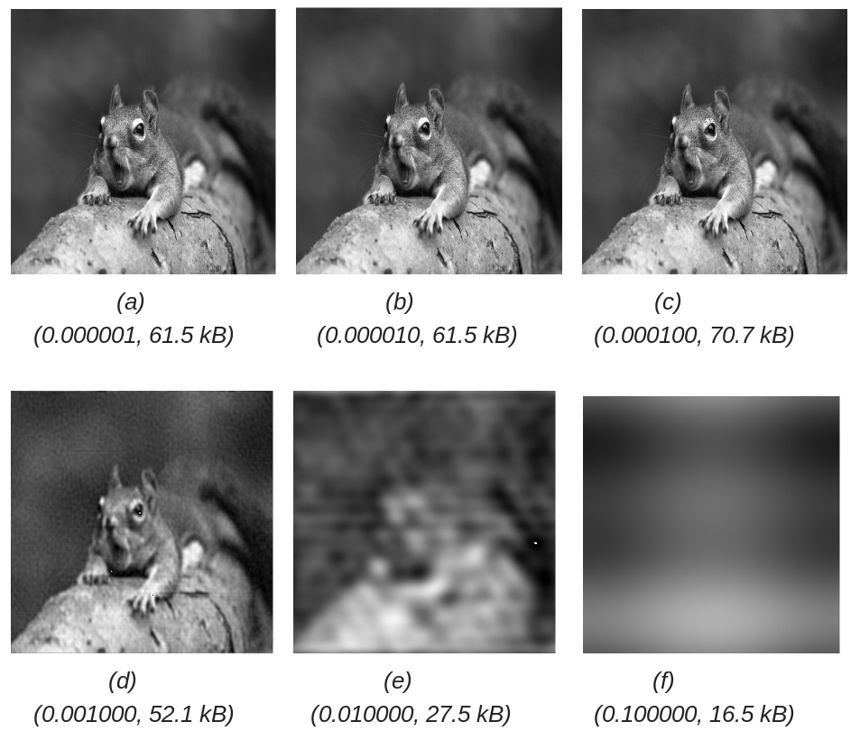
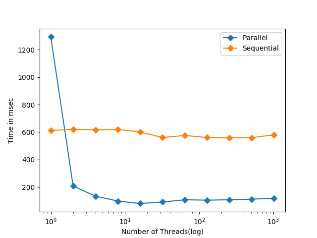
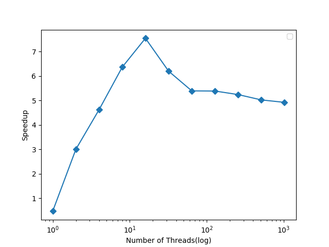

# Parallel-FFT
A CUDA based implementation of Fast Fourier Transform

The aim of the project was to provide a parallel implementation of  Fast Fourier Transform (FFT) method. FFT is a widely used method for various purposes. In our project we have implemented two uses of FFT. They are - 
- Multiplication of two polynomials
- Image compression

Multiplication of polynomials usually takes O(n\*m where one polynomial has n and other has m terms. This can be reduced to O(n\*log(m)) by using FFT. 

One of the other uses of FFT include image compression. Fourier techniques allow us to decompose an image in the frequency domain, remove or alter particular frequencies and then reconstruct the image. This is beneficial for image compression as by removing certain frequencies the compressed image contains less information.

Performance for both the implementations ,i.e., parallel and sequential have been visualized by plotting a graph between time taken and number of threads. We have exploited parallelism over 1D FFT function calls. This also parallelised 2D FFT methods.

# Results

## Image Compression
Following results show compression done on an image at various threshold level.

|  |
| :-----------: |
| Compressed image at various threshold level showing size of the compressed image. Format - (Threshold factor, size) |

## Polynomial Multiplication
Sequential and parallel implementations of FFT has been compared based on the execution time of the program for different size of data (N).

For N = 100000

|  |
| :-----------: |
| (a) Time taken by parallel and sequential implementations for different threads |

|  |
| :-----------: |
| (b) Speedup of parallel implementation as compared to sequential |

# Conclusions
1. As we are increasing threshold factor for compression of images, we are losing more and more information as lower frequency components of the images are filtered out. Thus, image is becoming more blur.
2. For lower number of threads, parallel implementation takes more time due to overhead involved in creation of threads. This can be observed from the fact that speedup is less than 1. But, as number of threads are increased expected behaviour is observed as parallel implementation executes faster than sequential.

# References
1. [Link](https://www.youtube.com/watch?v=L9T3jNbCYf8&t=1603s) to youtube video referred for image compression
2. [Link](https://en.wikipedia.org/wiki/Cooley%E2%80%93Tukey_FFT_algorithm) to wikipedia article referred for Cooley-Tukey algorithm
3. [Link](https://stackoverflow.com/questions/11333454/2d-fft-using-1d-fft) to article on how to perform 2D-FFT using 1D-FFT
4. [Link](https://www.dspguide.com/ch27/6.htm) for article on JPEG compression of images using FFT
5. [Link](https://medium.com/@aiswaryamathur/understanding-fast-fourier-transform-from-scratch-to-solve-polynomial-multiplication-8018d511162f) for polynomial multiplication using FFT
6. [Link](https://www.nvidia.com/docs/IO/116711/sc11-cuda-c-basics.pdf?fbclid=IwAR06iLF98JAj1q7DQVN6EPkgu-DIBPX1wrqhGqBi8isGK0mjG5kBsLLcXRU) for CUDA basics

# Contributers
1. Praveen Balireddy (praveeniitkgp1994@gmail.com)
2. Aman Joshi (amanjoshi668@gmail.com)
3. Shubham Pokhriyal (shubham.pokhriyal@students.iiit.ac.in)

For more details, please refer to the "IPSC_report.pdf" in the repo.